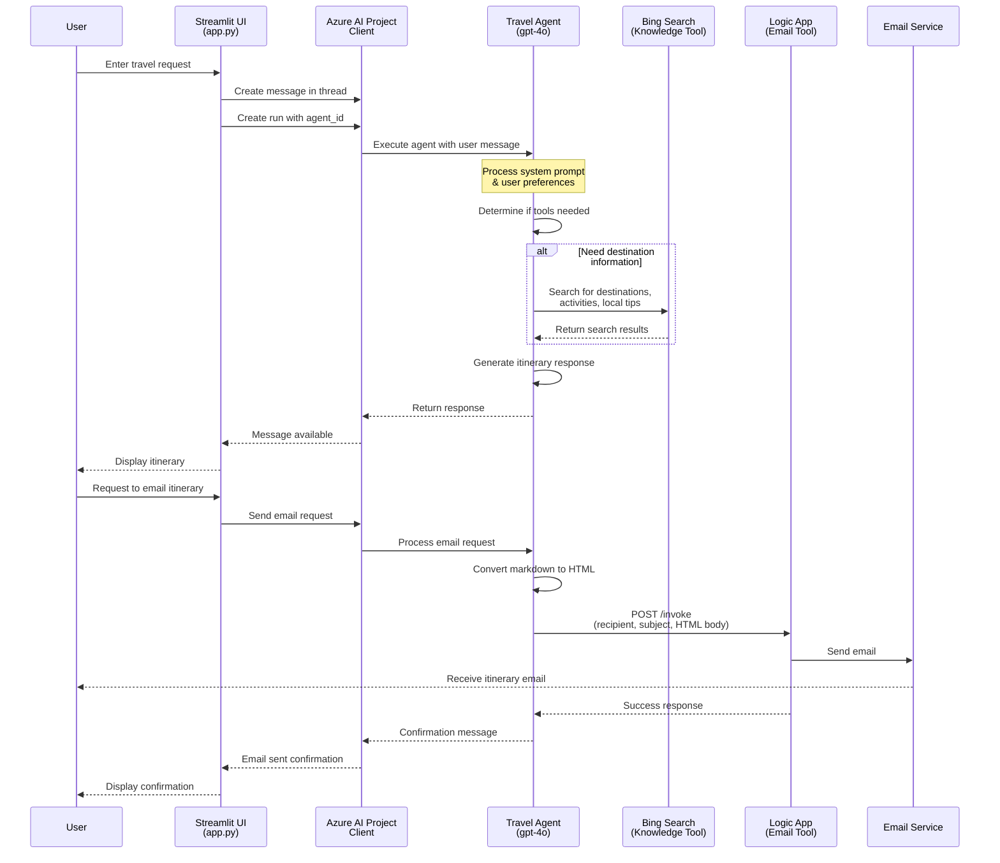

# Travel Agent Assistant

## Overview

This demo showcases a simple, AI-powered Travel Assistant built with **Azure AI Foundry** and **Azure AI Agents**. The agent helps users plan personalized travel itineraries for destinations across Europe and Asia based on their preferences including budget, duration, interests, dietary needs, and group composition.

### Key Features

- **Intelligent Conversation**: The agent asks relevant questions to understand user preferences (budget, travel duration, interests, fitness level, etc.)
- **Real-time Information**: Uses **Bing Search** (Knowledge Tool) to fetch up-to-date destination information, activities, and local tips
- **Email Integration**: Sends finalized itineraries via email using an **Azure Logic App** (Action Tool)
- **Streamlit UI**: Optional web interface for easy interaction with the agent
- **Guardrails**: Enforces travel planning constraints (1-7 days, Europe/Asia only, same continent per trip)

### Technologies Used

- **Azure AI Foundry**: AI project and agent orchestration platform
- **Azure AI Agents**: Agent framework with GPT-4o model
- **Bing Search**: Knowledge tool for real-time destination research
- **Azure Logic App**: Action tool for sending itinerary emails
- **Streamlit**: Python-based web UI framework
- **Python**: Core programming language

## Architecture Flow



## Setup

- Create an Azure AI Foundry Project
- Add a `gpt-4o` model deployment
- Create an agent
- Set the system prompt for the agent, see [AGENT_SYSTEM_PROMPT.md](AGENT_SYSTEM_PROMPT.md)
- Add the knowledge tool: Grounding with Bing Search
- Add the action tool: Logic App (create the logic app consumption (multi-tenant) resource using [`logic-app.json`](./logic-app.json))
  - See [LOGIC_APP_TOOL.md](LOGIC_APP_TOOL.md) for setup steps

## Demo Script

See [DEMO_SCRIPT.md](DEMO_SCRIPT.md)

## (Optional) UI Interface

```sh
python -mvenv .venv
source .venv/bin/activate
pip install streamlit azure-ai-projects azure-ai-agents azure-identity

cp .env-template .env
# Edit .env file with your project, agent id, and LLM deployment settings

streamlit run app.py
```
